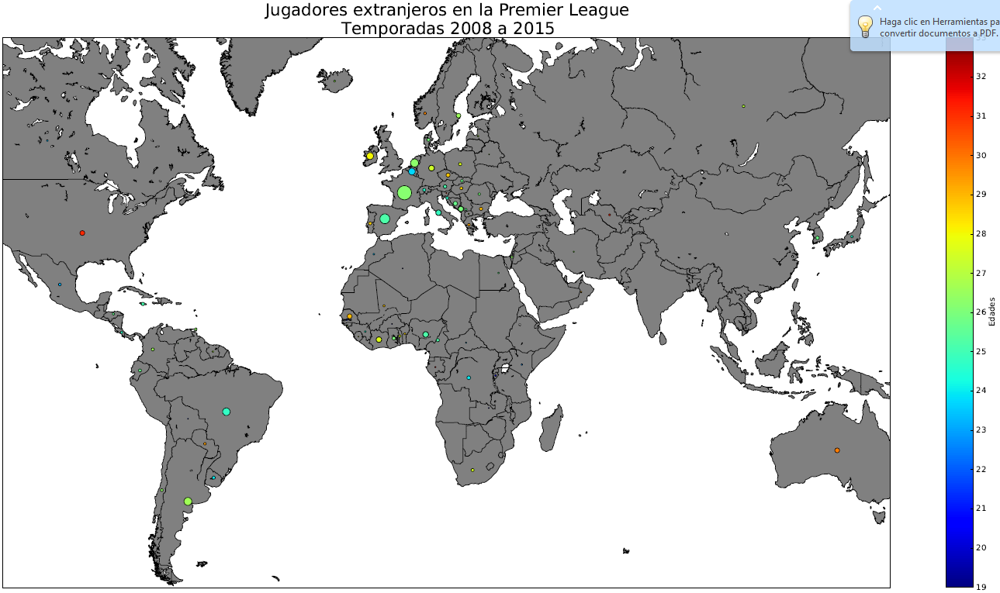
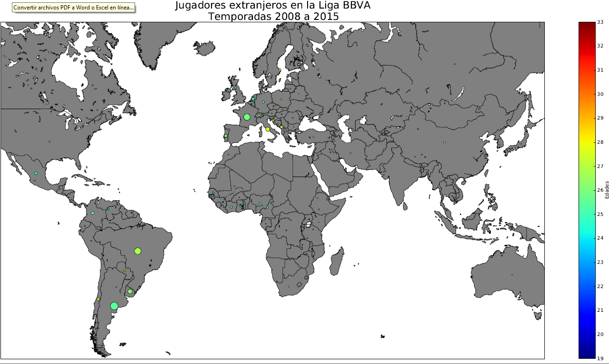
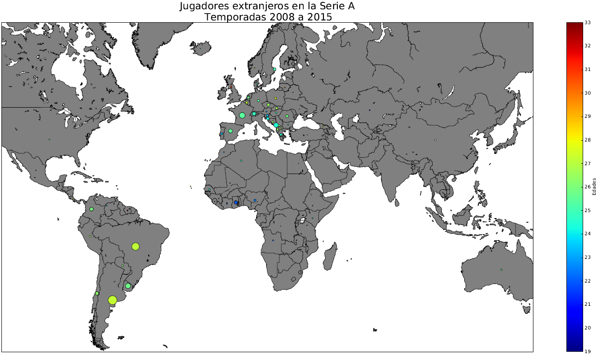
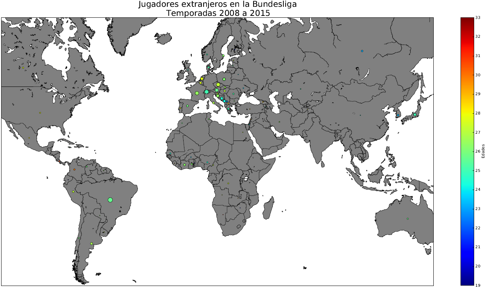
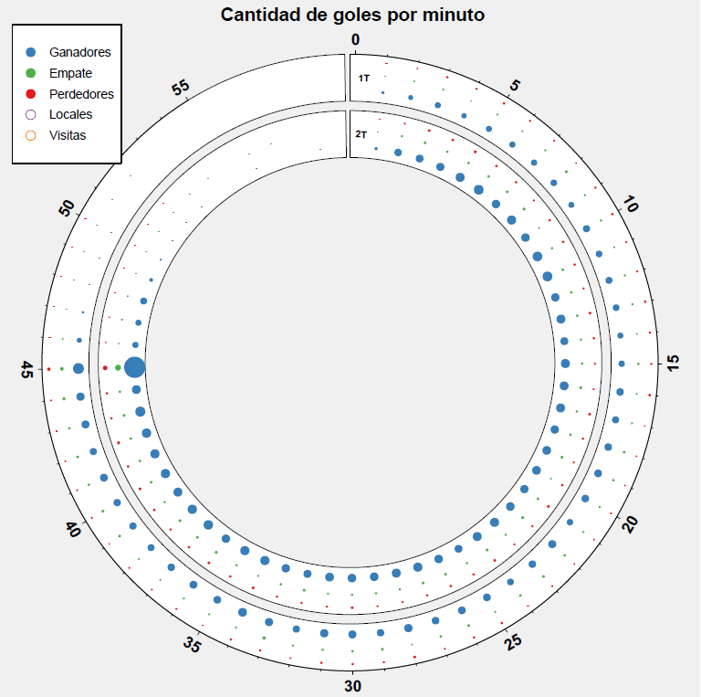
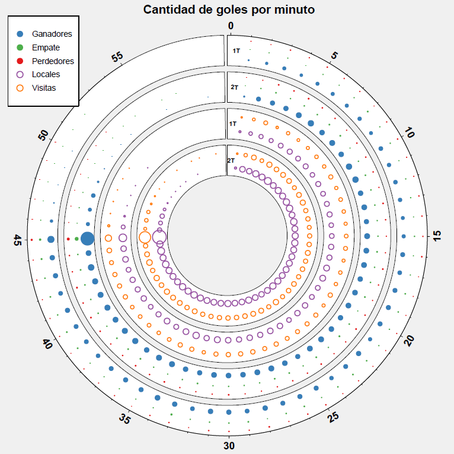

## Datos

1. 'European Soccer Database' disponible en <https://kaggle.com/hugomathien/soccer>. Cuenta con datos de mas de 25000 partidos y mas de 10000 jugadores para 11 ligas europeas, correspondientes a las temporadas del 2008/2009 a 2015/2016.
2. Los datos vienen en tablas en formato SQL. Las tablas contienen información sobre, Partidos, Equipos, Ligas, Paises, Jugadores y sus caracteristicas (e.g. regate, velocidad, potencia, etc). 

--- .class #id 

## Mapa de Jugadores extranjeros en las cuatro ligas mas importantes (Felipe Ramirez)

--- .class #id 

###  Mapa Premier League




--- .class #id

###  Mapa Liga BBVA



--- .class #id

###  Mapa Serie A



--- .class #id

###  Mapa Bundesliga 



--- .class #id

###  Mapa todas las ligas


--- .class #id

## Visualizacion goles por minuto (Ismael Gomez)

--- .class #id 

### Cantidad de goles por minuto 




--- .class #id 

### Cantidad de goles por minuto, distincion entre equipos locales y visita




--- .class #id 

## Motion Chart temporada 2015/2016 Serie A, Liga BBVA y Premier League (Cristobal Montt)

--- .class #id 


### Motion Chart temporada 2015/2016

```{r echo = FALSE, results='asis', message=FALSE}
setwd("C:/Users/lorel_000/Dropbox/taller shared")
#install.packages("googleVis")
library(googleVis)
# ver http://stackoverflow.com/questions/10258970/default-variables-for-a-googlevis-motionchart
# ver https://cran.r-project.org/web/packages/googleVis/vignettes/googleVis_examples.html
library(RSQLite)
library(dplyr)
library(tidyr)
# conectarse a archivo sql
con <- dbConnect(SQLite(), dbname=paste0(getwd(),"/databases/soccer/database.sqlite"))

# obtener lista de todas las tablas
tablas <- dbListTables(con)

# obtener las tablas como dataframes
player       <- tbl_df(dbGetQuery(con,"SELECT * FROM player"))
player_stats <- tbl_df(dbGetQuery(con,"SELECT * FROM player_stats"))
Match        <- tbl_df(dbGetQuery(con,"SELECT * FROM Match"))
Team         <- tbl_df(dbGetQuery(con,"SELECT * FROM Team"))
Country      <- tbl_df(dbGetQuery(con,"SELECT * FROM Country"))
League       <- tbl_df(dbGetQuery(con,"SELECT * FROM League"))
SQLite       <- tbl_df(dbGetQuery(con,"SELECT * FROM sqlite_sequence"))

#----------------------------------------------------------
# Variables necesarias para hacer motion chart:
#           - league_id
#           - season (podría usar date)
#           - stage (número del partido e.g. 1 igual priemr partido)
#           - o date en vez de stage
#           - home_team_api_id
#           - away_team_api_id
#           - home_team_goal
#           - away_team_goal


# Partiendo por lo simple, extraer league_id, season, stage, home_team_api_id, 
# away_team_api_id. home_team_goal, away_team_goal, match_api_id
# sólo las 4 ligas más importantes

# obteniendo nombres home teams
home <- dbGetQuery(con,"SELECT league_id, season, stage, date, team_long_name, home_team_api_id, 
                         home_team_goal, away_team_goal, match_api_id
                        FROM Match JOIN Team
                         ON Match.home_team_api_id = Team.team_api_id 
                        WHERE league_id == 1729 or league_id == 7775 
                        or league_id == 10223 or league_id == 21484")

# obteniendo nombres away teams
away <- dbGetQuery(con,"SELECT league_id, season, stage, date, team_long_name, 
                         away_team_api_id, home_team_goal, away_team_goal, match_api_id
                        FROM Match JOIN Team
                        ON Match.away_team_api_id = Team.team_api_id 
                        WHERE league_id == 1729 or league_id == 7775 
                        or league_id == 10223 or league_id == 21484")

# agregar tiros a df home y away


#---------------------------------------------------------
# añadir variables: ptos_home_team, ptos_away_team
#---------------------------------------------------------

# cree var difgoals para obtener puntos obtenidos por partido
dh_ptos <- home %>% mutate(difgoals = home_team_goal - away_team_goal)
dh_ptos <- dh_ptos %>% mutate(pts_home_team = ifelse(difgoals > 0, 3,
                                               ifelse(difgoals == 0 ,1,
                                                      ifelse(difgoals < 0, 0, NA))))

da_ptos <- away %>% mutate(difgoals = away_team_goal - home_team_goal)
da_ptos <- da_ptos %>% mutate(pts_away_team = ifelse(difgoals > 0, 3,
                                                      ifelse(difgoals == 0 ,1,
                                                             ifelse(difgoals < 0, 0, NA))))

# Agregar received_goals. En data_home sería iguala away_team_goal
# en data_away, seria igual a home_team_goal

data_home <- dh_ptos[, c(1:5,7,8,11,6,9)]
data_away <- da_ptos[, c(1:5,8,7,11,6,9)]

names(data_home)[c(5,6,7,8,9,10)] <- c("team", "goles_partido", "goles_recibidos_partido", 
                                  "puntos_partido","team_id","match_id")
names(data_away)[c(5,6,7,8,9,10)] <- c("team", "goles_partido", "goles_recibidos_partido", 
                                  "puntos_partido","team_id","match_id")

dfawayhome <- rbind(data_home, data_away)

# Agregar diferencia de goles quitar 00:00:00 de var date

dfawayhome <- dfawayhome %>% mutate(difgoles = goles_partido - goles_recibidos_partido)

dfawayhome$date <- sub(" 00:00:00$", "", dfawayhome$date)

dfawayhome <- arrange(dfawayhome, league_id, season, team, date, stage)

ligas <- dfawayhome %>% group_by(season, team) %>%
                        mutate(goles = cumsum(goles_partido), 
                               puntos = cumsum(puntos_partido), 
                               goles_recibidos = cumsum(goles_recibidos_partido), 
                               dif_goles = cumsum(difgoles))

#--------------------------------------
# eligiendo ligas
#--------------------------------------

ligas20152016 <- filter(ligas, 
                        (league_id == 1729 | league_id == 21484 | league_id == 10223) 
                        & season == "2015/2016")

#------------------------------------------------------
###ojo! ver si puedo agregar aquí las filas
# si hay equipos que juegan hasta fechas anteriores a la última fecha desaparecen del 
# gráfico, bastaría con agregar una sola fila por equipo con la fecha del 
# máximo de la variable date.
#------------------------------------------------------

#--------------------------------------------------------------------------------------
# SOLUCIÓN más FACIL, modificar fecha de stage 38 por el max de date y listo!
#--------------------------------------------------------------------------------------

ligas20152016[ligas20152016$stage==38, "date" ] <-  "2016-05-17"
ligas20152016$date <- as.Date(ligas20152016$date, "%Y-%m-%d")


#------------------------------------------------------
# State settings: x-axis: puntos
#                 y-axis: dif_goles
#                 color: league_id
#                 size: goles
# no he podido cambiar la barra de tiempo!

# CAMBIAR valores SETTINGS!!

myState <- '
{"orderedByX":false,
"xZoomedIn":false,
"nonSelectedAlpha":0.4,
"uniColorForNonSelected":false,
"yZoomedIn":false,"xLambda":1,
"showTrails":false,
"yZoomedDataMax":83,
"xZoomedDataMax":91,
"sizeOption":"14",
"yZoomedDataMin":-49,
"time":"1",
"colorOption":"2",
"dimensions":{"iconDimensions":["dim0"]},
"playDuration":40000,"yLambda":1,
"yAxisOption":"11",
"xZoomedDataMin":0,
"iconKeySettings":[],
"duration":{"multiplier":1,"timeUnit":"Y"},
"iconType":"BUBBLE",
"xAxisOption":"12",
"orderedByY":false}
'

motionLigas <- gvisMotionChart(ligas20152016, 
                               idvar="team", 
                               timevar="date",
                               options=list(width=700, height=400, state=myState))
print(motionLigas, tag ='chart')
```


